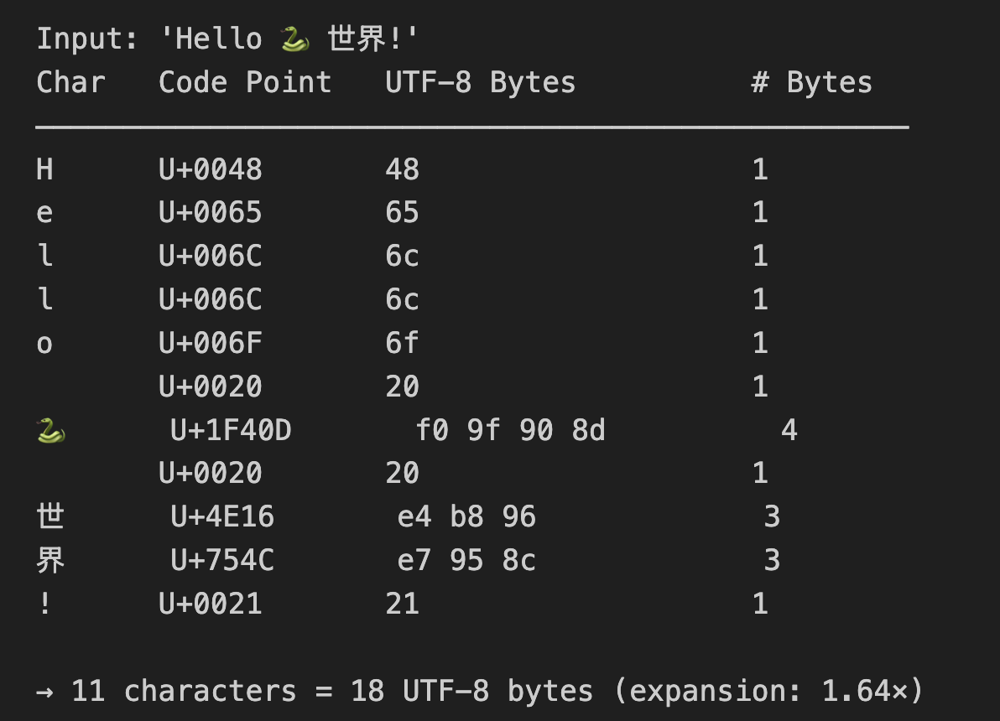
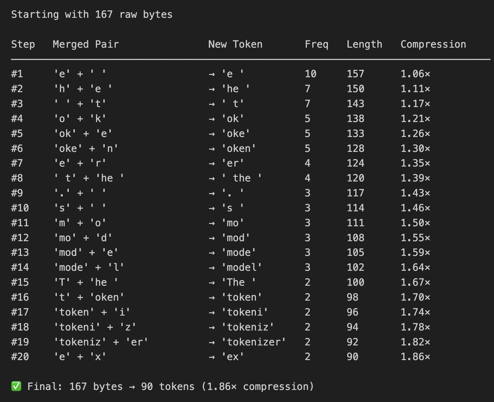
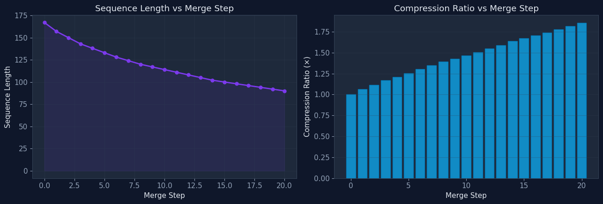
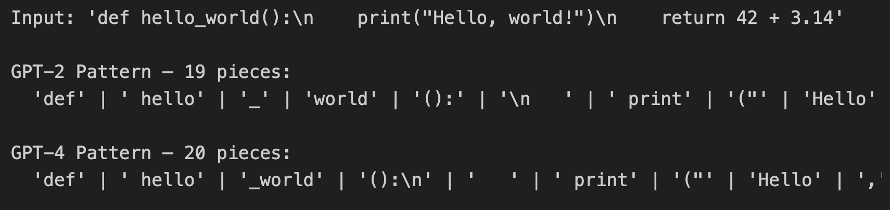
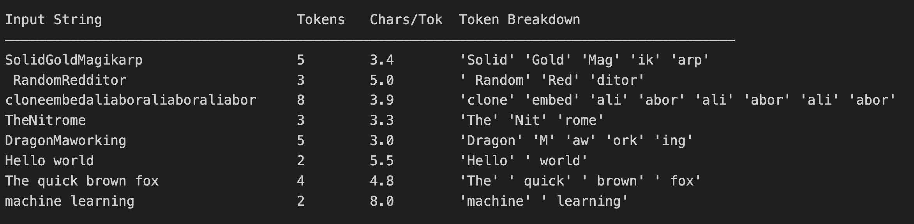
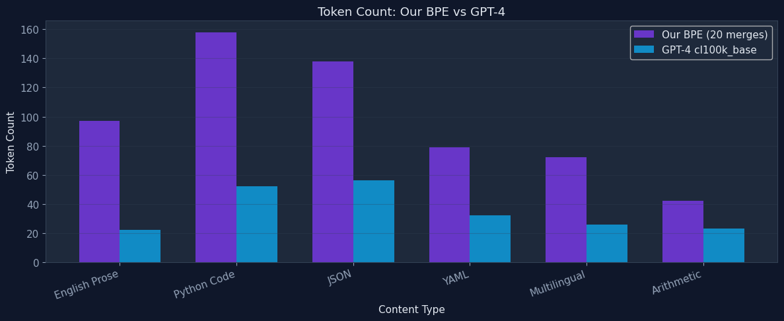

# 🧬 The Tokenizer Fun: From Bytes to BPE

A progressive, hands-on Jupyter Notebook that guides you from raw Python strings to a fully functional Byte Pair Encoding (BPE) tokenizer.

> **Heavily inspired by Andrej Karpathy's excellent video: [Let's build the GPT Tokenizer](https://www.youtube.com/watch?v=zduSFxRajkE)**

## Notebook Sections

### 1. Unicode & Byte Inspection Lab
Explore how characters map to Unicode code points and UTF-8 byte sequences. Input emojis (🐍), flags (🇯🇵), and non-English text to see how a single character can expand into 1–4+ bytes.



### 2. BPE Algorithm Scratchpad
Implement the core BPE functions (`get_stats`, `merge`) from scratch. Step through the iterative merge process and visualize compression ratios at each step.




### 3. Regex Splitter Visualization
Test the GPT-2 and GPT-4 pre-tokenization regex patterns on code snippets and natural text. See how splitting prevents cross-category merges (e.g., keeping `"dog"` separate from `"dog."`).



### 4. Glitch Token Investigator
Investigate the "SolidGoldMagikarp" phenomenon — tokens that exist in the vocabulary but were never seen during model training, causing bizarre hallucinations.



### 5. Tiktoken Benchmarking
Compare your scratch-built BPE tokenizer against GPT-4's `cl100k_base` encoding. Measure compression density across English prose, Python code, JSON, YAML, and multilingual text.




## Getting Started

```bash
pip install -r requirements.txt
jupyter notebook tokenizer_fun.ipynb
```

## Acknowledgments

This project is heavily inspired by [Andrej Karpathy](https://karpathy.ai/)'s video **[Let's build the GPT Tokenizer](https://www.youtube.com/watch?v=zduSFxRajkE)**, which provides an outstanding deep dive into how tokenizers work and why they matter for LLMs.
